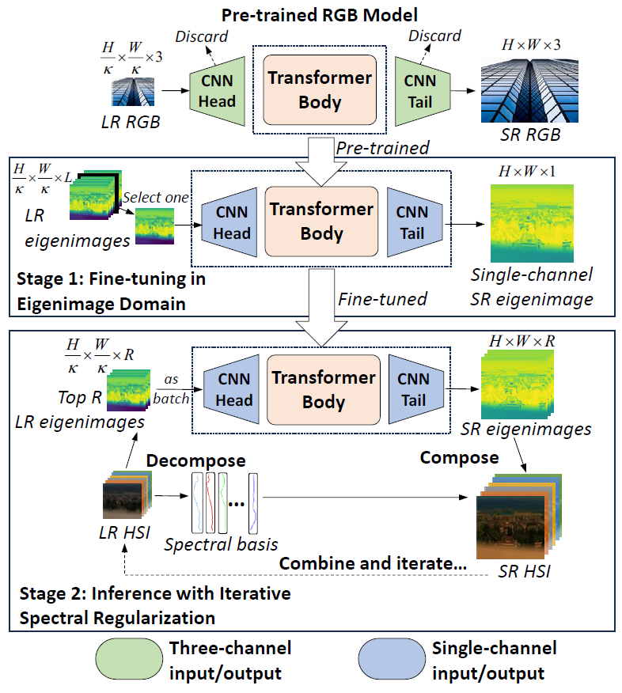

# EigenSR [AAAI 2025]

Official implementation of the paper "EigenSR: Eigenimage-Bridged Pre-Trained RGB Learners for Single Hyperspectral Image Super-Resolution".

Paper link: [[arXiv]](https://arxiv.org/abs/2409.04050v2)

*Single hyperspectral image super-resolution (single-HSI-SR) aims to improve the resolution of a single input low-resolution HSI. Due to the bottleneck of data scarcity, the development of single-HSI-SR lags far behind that of RGB natural images. In recent years, research on RGB SR has shown that models pre-trained on large-scale benchmark datasets can greatly improve performance on unseen data, which may stand as a remedy for HSI. But how can we transfer the pre-trained RGB model to HSI, to overcome the data-scarcity bottleneck? Because of the significant difference in the channels between the pre-trained RGB model and the HSI, the model cannot focus on the correlation along the spectral dimension, thus limiting its ability to utilize on HSI. Inspired by the HSI spatial-spectral decoupling, we propose a new framework that first fine-tunes the pre-trained model with the spatial components (known as eigenimages), and then infers on unseen HSI using an iterative spectral regularization (ISR) to maintain the spectral correlation. The advantages of our method lie in: 1) we effectively inject the spatial texture processing capabilities of the pre-trained RGB model into HSI while keeping spectral fidelity, 2) learning in the spectral-decorrelated domain can improve the generalizability to spectral-agnostic data, and 3) our inference in the eigenimage domain naturally exploits the spectral low-rank property of HSI, thereby reducing the complexity. This work bridges the gap between pre-trained RGB models and HSI via eigenimages, addressing the issue of limited HSI training data, hence the name EigenSR. Extensive experiments show that EigenSR outperforms the state-of-the-art (SOTA) methods in both spatial and spectral metrics.*

  

Main Contributions

1) We propose a new framework for single-HSI-SR that first introduces large-scale pre-trained RGB models into HSI. It leverages pre-trained models learned from abundant RGB images to address the data-scarcity problem of HSI.
2) Our method is based on the HSI spatial-spectral decoupling. We inject the spatial texture knowledge provided by the pre-trained model to the spatial part via fine-tuning, and regularize the spectral correlation when inferring on unseen data. This effectively leverages the pre-trained model while maintaining the spectral fidelity.
3) Extensive experiments demonstrate that our method surpasses the current SOTA methods in both spatial and spectral metrics, validating the effectiveness of introducing the pre-trained RGB models.

*Figure 1: The motivation. The lack of HSI training data is the main bottleneck for single-HSI-SR. The channel differences between RGB and HSI make it challenging to directly transfer RGB models to HSI. Inspired by spectral-spatial decoupling, we leverage spatial part of HSI, namely eigenimages, to bridge the gap between pre-trained RGB models and HSI, and constrain the spectral part to keep spectral fidelity.*

*Figure 2: The flowchart of EigenSR. It consists of two stages. Stage 1 uses the pre-trained Transformer Body to fine-tune a single-channel model in the eigenimage domain. Stage 2 utilizes the fine-tuned model for inference with iterative spectral regularization on unseen LR HSI.*

## Preparation

