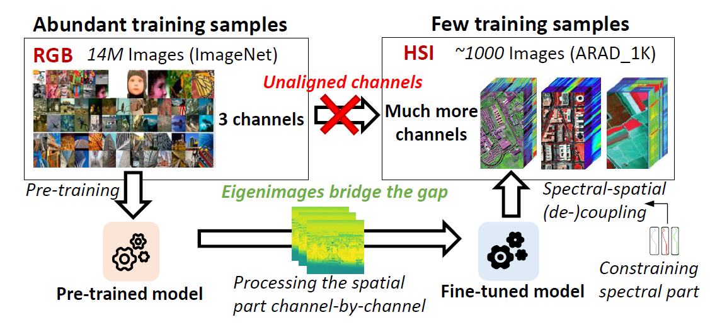

# EigenSR [AAAI 2025]

Official implementation of the paper "EigenSR: Eigenimage-Bridged Pre-Trained RGB Learners for Single Hyperspectral Image Super-Resolution".

Authors: Xi Su, Xiangfei Shen, Mingyang Wan, Jing Nie, Lihui Chen, Haijun Liu, and Xichuan Zhou.

Paper link: [[arXiv]](https://arxiv.org/abs/2409.04050v2)

*Single hyperspectral image super-resolution (single-HSI-SR) aims to improve the resolution of a single input low-resolution HSI. Due to the bottleneck of data scarcity, the development of single-HSI-SR lags far behind that of RGB natural images. In recent years, research on RGB SR has shown that models pre-trained on large-scale benchmark datasets can greatly improve performance on unseen data, which may stand as a remedy for HSI. But how can we transfer the pre-trained RGB model to HSI, to overcome the data-scarcity bottleneck? Because of the significant difference in the channels between the pre-trained RGB model and the HSI, the model cannot focus on the correlation along the spectral dimension, thus limiting its ability to utilize on HSI. Inspired by the HSI spatial-spectral decoupling, we propose a new framework that first fine-tunes the pre-trained model with the spatial components (known as eigenimages), and then infers on unseen HSI using an iterative spectral regularization (ISR) to maintain the spectral correlation. The advantages of our method lie in: 1) we effectively inject the spatial texture processing capabilities of the pre-trained RGB model into HSI while keeping spectral fidelity, 2) learning in the spectral-decorrelated domain can improve the generalizability to spectral-agnostic data, and 3) our inference in the eigenimage domain naturally exploits the spectral low-rank property of HSI, thereby reducing the complexity. This work bridges the gap between pre-trained RGB models and HSI via eigenimages, addressing the issue of limited HSI training data, hence the name EigenSR. Extensive experiments show that EigenSR outperforms the state-of-the-art (SOTA) methods in both spatial and spectral metrics.*

<details>
  
<summary>Main Contributions</summary>

1) We propose a new framework for single-HSI-SR that first introduces large-scale pre-trained RGB models into HSI. It leverages pre-trained models learned from abundant RGB images to address the data-scarcity problem of HSI.
2) Our method is based on the HSI spatial-spectral decoupling. We inject the spatial texture knowledge provided by the pre-trained model to the spatial part via fine-tuning, and regularize the spectral correlation when inferring on unseen data. This effectively leverages the pre-trained model while maintaining the spectral fidelity.
3) Extensive experiments demonstrate that our method surpasses the current SOTA methods in both spatial and spectral metrics, validating the effectiveness of introducing the pre-trained RGB models.

</details>



*Figure 1: The motivation. The lack of HSI training data is the main bottleneck for single-HSI-SR. The channel differences between RGB and HSI make it challenging to directly transfer RGB models to HSI. Inspired by spectral-spatial decoupling, we leverage spatial part of HSI, namely eigenimages, to bridge the gap between pre-trained RGB models and HSI, and constrain the spectral part to keep spectral fidelity.*


*Figure 2: The flowchart of EigenSR. It consists of two stages. Stage 1 uses the pre-trained Transformer Body to fine-tune a single-channel model in the eigenimage domain. Stage 2 utilizes the fine-tuned model for inference with iterative spectral regularization on unseen LR HSI.*

## Preparation

### Environment and Dependencies
This project is developed and tested using Python 3.9. We recommend using Anaconda for environment installation:
```bash
# Create a conda environment
conda create -y -n EigenSR python=3.9

# Activate the environment
conda activate EigenSR

# Install requirements
pip install -r requirements.txt
```

### Pre-trained Models
We use the pre-trained RGB models from [IPT](https://github.com/huawei-noah/Pretrained-IPT) (Image Processing Transformer) for our hyperspectral image super-resolution. You can download the pre-trained models from their [Google Drive](https://drive.google.com/drive/folders/1MVSdUX0YBExauG0fFz4ANiWTrq9xZEj7).

Put the downloaded models (sr2 for example) into the `./pretrained/` directory, and it should look like this:
```bash
./pretrained/
├── IPT_sr2.pt
├── ...
```

### Datasets
Download the HSI datasets from the following links:

- [ARAD1K](https://github.com/JiangHe96/DL4sSR)
- [CAVE](https://cave.cs.columbia.edu/repository/Multispectral)
- [Harvard](https://vision.seas.harvard.edu/hyperspec/d2x5g3/)
- [Pavia Centre](https://www.ehu.eus/ccwintco/index.php/Hyperspectral_Remote_Sensing_Scenes)
- [Washington DC Mall](https://rslab.ut.ac.ir/data)
- [Chikusei](https://naotoyokoya.com/Download.html)

and put them into `./your_own_datasets/`. Split them into `train` and `test`, and organize them as follows (taking ARAD1K as an example):
```bash
./your_own_datasets/
├── ARAD1K
│   ├── test
│   │   ├── hsi
│   │   │   ├── ARAD_1K_0901.mat
│   │   │   ├── ARAD_1K_0902.mat
│   │   │   ├── ...
│   ├── train
│   │   ├── hsi
│   │   │   ├── ARAD_1K_0001.mat
│   │   │   ├── ARAD_1K_0002.mat
│   │   │   ├── ...
```

The RGB dataset [NWPU RESISC45](https://tensorflow.google.cn/datasets/catalog/resisc45) should be organized as follows:
```bash
./your_own_datasets/
├── NWPU-RESISC45
│   ├── test
│   │   ├── rgb
│   │   │   ├── airplane_001.jpg
│   │   │   ├── airplane_002.jpg
│   │   │   ├──...
│   ├── train
│   │   ├── rgb
│   │   │   ├── airplane_003.jpg
│   │   │   ├── airplane_004.jpg
│   │   │   ├──...
```

## Training

By simply running the script `train_hsi.py` using:
```bash
python train_hsi.py
```
you can train the model with HSIs. The default configuration is in `train_config.py`,
and it is used to train on the ARAD1K training set at a scale of $\times 2$.
You can modify the configuration file to train the model with your own datasets.
If you want to train on RGB images, please use `train_rgb.py`.

## Testing

The inference script `test.py` is a powerful tool to test the model on the datasets you define.
It was implemented using the Iterative Spectral Regularization (ISR) algorithm mentioned in our paper.
It needs to be configured with the following main parameters:
- `scale`: The scale factor of the super-resolution.
- `pretrained_model_fn`: The path to the pre-trained ViT body.
- `finetuned_trainable_fn`: The path to the fine-tuned trainable part (LoRA + Head + Tail) from the previous training step.
- `iters`: The iteration number of ISR.
- `beta`: The combination weight constant.
- `eigen_dims`: The channel number of the eigenimages.
- `src_lr_hsi_folder`: The path to the low-resolution source images to be processed.
- `ref_hr_hsi_folder`: The path to the high-resolution reference images (can be left empty).
- `dst_sr_folder`: The path to save the generated SR images (can be left empty).

For example, organize the test data as follows:
```bash
./your_src_folder/
├── img1.mat
├── img2.mat
├── ...
```
where the HSI (H, W, C) is stored in the variable `data` in the `.mat` files. You can get the following generated results in the dst folder:
```bash
./your_dst_folder/
├── img1.mat
├── img2.mat
├── ...
```
By adding the additional ref folder as:
```bash
./your_ref_folder/
├── img1.mat
├── img2.mat
├── ...
```
the metrics will be calculated and printed in the console.

Just have fun! =)

## Citation
If you find our work helpful in your research, please consider citing:
```bibtex
@article{su2024eigensr,
  title={EigenSR: Eigenimage-Bridged Pre-Trained RGB Learners for Single Hyperspectral Image Super-Resolution},
  author={Su, Xi and Shen, Xiangfei and Wan, Mingyang and Nie, Jing and Chen, Lihui and Liu, Haijun and Zhou, Xichuan},
  journal={arXiv preprint arXiv:2409.04050},
  year={2024}
}
```

## Acknowledgements
The Transformer body part is mainly from [IPT](https://github.com/huawei-noah/Pretrained-IPT), and the PyTorch implementation of MATLAB imresize function is from [bicubic_pytorch](https://github.com/sanghyun-son/bicubic_pytorch).

Thanks for their excellent works!


